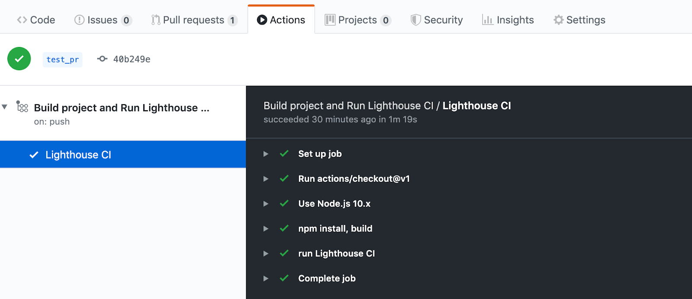
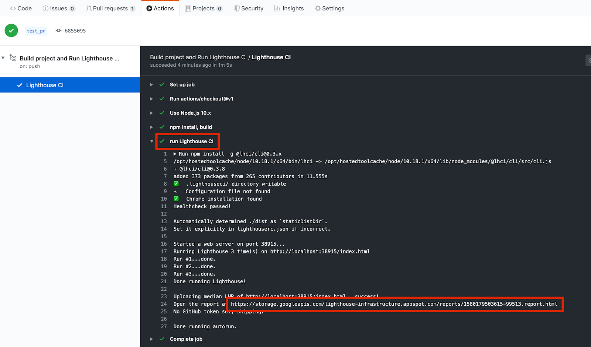
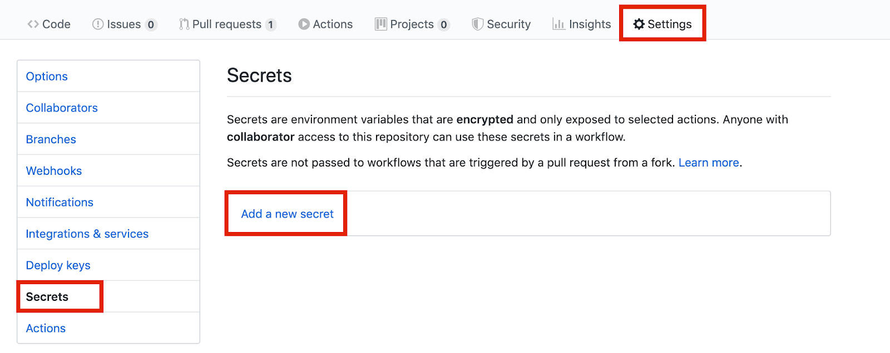
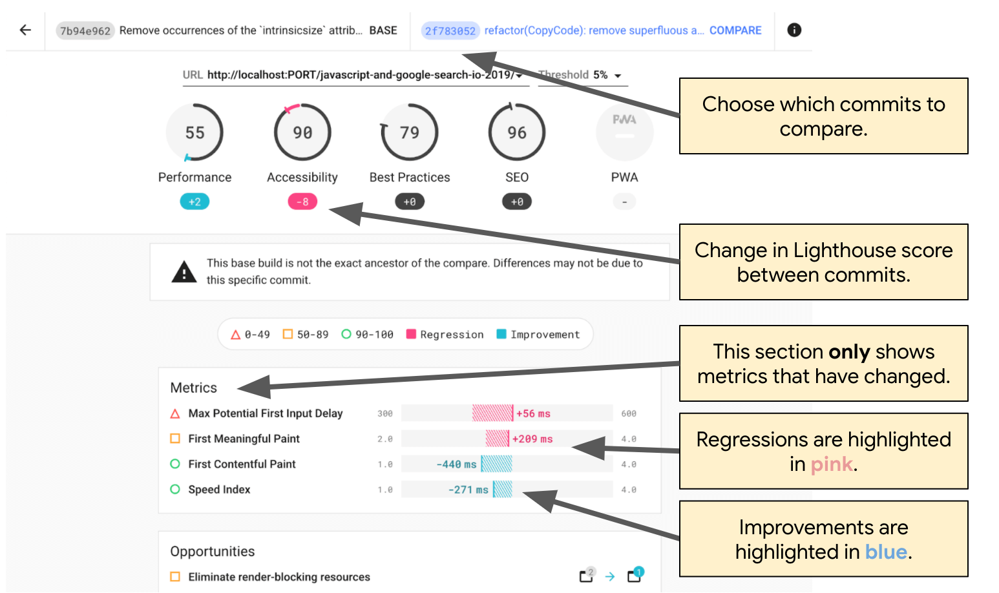

[Lighthouse CI](https://github.com/GoogleChrome/lighthouse-ci) is a suite of tools for using Lighthouse during continuous integration. Lighthouse CI can be incorporated into developer workflows in many different ways. This guide covers the following topics:
*   Using the Lighthouse CI CLI.
*   Configuring your CI provider to run Lighthouse CI.
*   Setting up a [GitHub Action](https://github.com/features/actions) and [status check](https://help.github.com/en/github/collaborating-with-issues-and-pull-requests/about-status-checks) for Lighthouse CI. This will automatically display Lighthouse results on GitHub pull requests.
*   Building a performance dashboard and data store for Lighthouse reports.

## Overview

Lighthouse CI is a suite of free tools that facilitate using Lighthouse for performance monitoring. A single Lighthouse report provides a snapshot of a web page's performance at the time that it is run; Lighthouse CI shows how these findings have changed over time. This can be used to identify the impact of particular code changes or ensure that performance thresholds are met during continuous integration processes. Although performance monitoring is the most common use case for Lighthouse CI, it can be used to monitor other aspects of the Lighthouse report - for example, SEO or accessibility.

The core functionality of Lighthouse CI is provided by the Lighthouse CI command line interface. (Note: This is a separate tool than the [Lighthouse CLI](https://github.com/GoogleChrome/lighthouse#using-the-node-cli).) The Lighthouse CI CLI provides a set of [commands](https://github.com/GoogleChrome/lighthouse-ci/blob/master/docs/configuration.md#commands) for using Lighthouse CI. For example, the `autorun` command executes multiple Lighthouse runs, identifies the median Lighthouse report, and uploads the report for storage. This behavior can be heavily customized by passing additional flags or customizing Lighthouse CI's configuration file, `lighthouserc.js`.

Although the core functionality of Lighthouse CI is primarily encapsulated in the Lighthouse CI CLI, Lighthouse CI is typically used through one of the following approaches:
*   Running Lighthouse CI as part of continuous integration
*   Using a Lighthouse CI GitHub action that runs and comments on every pull request
*   Tracking performance over time via the dashboard provided by Lighthouse Server.

All of these approaches are built upon the Lighthouse CI CLI.

Alternatives to Lighthouse CI include third-party performance monitoring services or writing your own script to collect performance data during the CI process. You should consider using a third-party service if you'd prefer to let someone else handle the management of your performance monitoring server and test devices, or, if you want notification capabilities (such as email or Slack integration) without having to build these features yourself.

## Use Lighthouse CI locally

This section explains how to run and install the Lighthouse CI CLI locally and how to configure `lighthouserc.js`. Running the Lighthouse CI CLI locally is the easiest way to make sure that your `lighthouserc.js` is configured correctly.

1.  Install the Lighthouse CI CLI.

```shell
npm install -g @lhci/cli
```

Lighthouse CI is configured by placing a `lighthouserc.js` file in the root of your project's repo. This file is mandatory and will contain Lighthouse CI related configuration information.

2.  In the root of your repository, create a `lighthouserc.js` [configuration file](https://github.com/GoogleChrome/lighthouse-ci/blob/v0.4.1/docs/configuration.md#configuration-file). 

```shell
touch lighthouserc.js
```

3.  Add the following code to `lighthouserc.js`. Update the `url` property if you normally access your app at a URL different from `http://localhost:8080`.

```js
module.exports = {
  ci: {
    collect: {
      url: ['http://localhost:8080']
    },
    upload: {
      target: 'temporary-public-storage',
    },
  },
};
```

This configuration tells Lighthouse CI to run Lighthouse on the web page located at `http://localhost:8080`. By default, Lighthouse CI will run Lighthouse three times. Afterwards, it will upload the [`median-run`](https://github.com/GoogleChrome/lighthouse-ci/blob/v0.4.1/docs/configuration.md#aggregation-methods) Lighthouse report to temporary public storage. The report will remain there for 7 days and then be automatically deleted. The storage location will be similar to this: 

[https://storage.googleapis.com/lighthouse-infrastructure.appspot.com/reports/1580152437799-46441.report.html](https://storage.googleapis.com/lighthouse-infrastructure.appspot.com/reports/1580152437799-46441.report.html) (This URL won't work because the report has already been deleted.)

4.  Finish setting up `lighthouserc.js` by providing either the directory that contains your project's static files, or, the command to run its web server. This allows Lighthouse CI to load URL(s) specified in `lighthouserc.js` by `ci.collect.url`.

    If your site is static, add the `staticDistDir` property to indicate where your static files are located. If your site is not static, use the [`startServerCommand`](https://github.com/GoogleChrome/lighthouse-ci/blob/v0.4.1/docs/configuration.md#startservercommand) to indicate the command that starts your server. 


 ```js
// Static site example
module.exports = {
  ci: {
    collect: {
      url: ['http://localhost:8080'],
      staticDistDir: './public',
    },
    upload: {
      target: 'temporary-public-storage',
    },
  },
};
```

 ```js
// Dynamic site example
module.exports = {
  ci: {
    collect: {
      url: ['http://localhost:8080'],
      startServerCommand: 'npm run start',
    },
    upload: {
      target: 'temporary-public-storage',
    },
  },
};
```

5.  Run the Lighthouse CI CLI from the terminal using the `autorun` command. This will run Lighthouse three times and upload the median Lighthouse report.

```shell
lhci autorun
```

If you've correctly configured Lighthouse CI, running this command should produce output similar to this:

```shell
✅  .lighthouseci/ directory writable
✅  Configuration file found
✅  Chrome installation found
⚠️   GitHub token not set
Healthcheck passed!

Started a web server on port 65324...
Running Lighthouse 3 time(s) on http://localhost:65324/index.html
Run #1...done.
Run #2...done.
Run #3...done.
Done running Lighthouse!

Uploading median LHR of http://localhost:65324/index.html...success!
Open the report at https://storage.googleapis.com/lighthouse-infrastructure.appspot.com/reports/1591720514021-82403.report.html
No GitHub token set, skipping GitHub status check.

Done running autorun.
```

Clicking on the link in the output that begins with `https://storage.googleapis.com...` will take you to the Lighthouse report corresponding to the median Lighthouse run.

The defaults used by `autorun` can be overridden via the command line or `lighthouserc.js`. For example, the `lighthouserc.js`configuration below indicates that five Lighthouse runs should be collected every time `autorun` executes.

6.  Update `lighthouserc.js` to use the `numberOfRuns` property:

```js
module.exports = {
    // ...
    collect: {
      numberOfRuns: 5
    },
   // ...
  },
};
```

7.  Re-run the `autorun` command:

```shell
lhci autorun
```

The terminal output should show that Lighthouse has been run five times rather than the default three:

```shell
✅  .lighthouseci/ directory writable
✅  Configuration file found
✅  Chrome installation found
⚠️   GitHub token not set
Healthcheck passed!

Automatically determined ./dist as `staticDistDir`.
Set it explicitly in lighthouserc.json if incorrect.

Started a web server on port 64444...
Running Lighthouse 5 time(s) on http://localhost:64444/index.html
Run #1...done.
Run #2...done.
Run #3...done.
Run #4...done.
Run #5...done.
Done running Lighthouse!

Uploading median LHR of http://localhost:64444/index.html...success!
Open the report at https://storage.googleapis.com/lighthouse-infrastructure.appspot.com/reports/1591716944028-6048.report.html
No GitHub token set, skipping GitHub status check.

Done running autorun.
```

To learn about other configuration options, refer to the Lighthouse CI [configuration documentation](https://github.com/GoogleChrome/lighthouse-ci/blob/master/docs/configuration.md).


## Setup your CI process to run Lighthouse CI

Lighthouse CI can be used with your favorite CI tool. The "[Configure Your CI Provider](https://github.com/GoogleChrome/lighthouse-ci/blob/master/docs/getting-started.md#configure-your-ci-provider)" section of the Lighthouse CI documentation contains code samples showing how to incorporate Lighthouse CI into the configuration files of common CI tools. Specifically, these code samples show how to run Lighthouse CI to collect performance measurements during the CI process.

Using Lighthouse CI to collect performance measurements is a good place to start with performance monitoring. However, advanced users may want to go a step further and use Lighthouse CI to fail builds if they don't meet pre-defined criteria such as passing particular Lighthouse audits or meeting all performance budgets. This behavior is configured through the [`assert`](https://github.com/GoogleChrome/lighthouse-ci/blob/master/docs/configuration.md#assert) property of the `lighthouserc.js` file.

Lighthouse CI supports three levels of assertions:
*   `off`: ignore assertions
*   `warn`: print failures to stderr
*   `error`: print failures to stderr and exit Lighthouse CI with a non-zero [exit code](https://www.gnu.org/software/bash/manual/html_node/Exit-Status.html#:~:text=A%20non%2Dzero%20exit%20status,N%20as%20the%20exit%20status.).

Below is an example of a `lighthouserc.js` configuration that includes assertions. It sets assertions for the scores of Lighthouse's performance and accessibility categories.

```js
module.exports = {
  ci: {
    collect: {
      url: ['http://localhost:8080'],
      numberOfRuns: 3,
    },
    assert: {
      assertions: {
        'categories:performance': ['warn', {minScore: 1}],
        'categories:accessibility': ['error', {minScore: 1}]
      }
    },
    upload: {
      target: 'temporary-public-storage',
    },
  },
};
```

The console output that it generates looks like this:

<figure class="w-figure">
  
  <figcaption>Lighthouse CI warning<figcaption>
</figure>

For more information on Lighthouse CI assertions, refer to the [documentation](https://github.com/GoogleChrome/lighthouse-ci/blob/master/docs/configuration.md#assert).

## Setup a GitHub Action to run Lighthouse CI

Note: This section assumes that you're familiar with:
*   Git
*   GitHub
*   GitHub Pull Requests

A [GitHub Action](https://github.com/features/actions) can be used to run Lighthouse CI. This will generate a new Lighthouse report every time that a code change is pushed to any branch of a GitHub repository. Use this in conjunction with a [status check](https://help.github.com/en/github/collaborating-with-issues-and-pull-requests/about-status-checks) to display these results on each pull request.

<figure class="w-figure">
  
  <figcaption>A Lighthouse CI status check<figcaption>
</figure>

1.  In the root of your repository, create a directory named `.github/workflows`. The [workflows](https://help.github.com/en/actions/configuring-and-managing-workflows/configuring-a-workflow#about-workflows) for your project will go in this directory. A workflow is a process that runs at a predetermined time (for example, when code is pushed) and is composed of one or more actions.

```shell
mkdir .github
mkdir .github/workflows
```

2.  In `.github/workflows` create a file named `lighthouse-ci.yaml`. This file will hold the configuration for a new workflow. 

```shell
touch lighthouse-ci.yaml
```

3.  Add the following text to `lighthouse-ci.yaml`. 

```yaml
name: Build project and run Lighthouse CI
on: [push]
jobs:
  lhci:
    name: Lighthouse CI
    runs-on: ubuntu-latest
    steps:
      - uses: actions/checkout@v1
      - name: Use Node.js 10.x
        uses: actions/setup-node@v1
        with:
          node-version: 10.x
      - name: npm install
        run: |
          npm install
      - name: run Lighthouse CI
        run: |
          npm install -g @lhci/cli@0.3.x
          lhci autorun --upload.target=temporary-public-storage || echo "LHCI failed!"
```

This configuration sets up a workflow consisting of a single job that will run whenever new code is pushed to the repository. This job has four steps:

*   Check out the repository that Lighthouse CI will be run against
*   Install and configure Node
*   Install required npm packages
*   Run Lighthouse CI and upload the results to temporary public storage.

4.  Commit these changes and push them to GitHub. If you've correctly followed the steps above, pushing code to GitHub will trigger running the workflow you just added.

5.  To confirm that Lighthouse CI has triggered and to view the report it generated, go to the "Actions" tab of your project, click "Build project and run Lighthouse CI", then click "Lighthouse CI". This displays the page for the "Lighthouse CI" job.

<figure class="w-figure">
  
  <figcaption>GitHub "Actions" tab<figcaption>
</figure>

Clicking on a step will display more information about its execution. Click on the "run Lighthouse CI" step to see the URL of the Lighthouse report that was just generated.

<figure class="w-figure">
  
  <figcaption>Lighthouse CI results displayed in the GitHub 'Actions' tab<figcaption>
</figure>

You've just set up a GitHub Action to run Lighthouse CI. This will be most useful when used in conjunction with a GitHub [status check](https://help.github.com/en/github/collaborating-with-issues-and-pull-requests/about-status-checks). 

A status check, if configured, is a message that appears on every PR and typically includes information such as the results of a test or the success of a build.

<figure class="w-figure">
  
  <figcaption>A Lighthouse CI status check<figcaption>
</figure>

The steps below explain how to set up a status check for Lighthouse CI.

1.  Go to the [Lighthouse CI GitHub App page](https://github.com/apps/lighthouse-ci) and click **Configure**.
2.  (Optional) If you're part of multiple organizations on GitHub, choose the organization that owns the repository for which you want to use Lighthouse CI.
3.  Select **All repositories** if you want to enable Lighthouse CI in all repositories or select **Only select repositories** if you only want to use it in specific repositories, and then select the repositories. Then click **Install & Authorize**.
4.  Copy the token that is displayed. You'll use it in the next step.
5.  To add the token, navigate to the **Settings** page of your GitHub repository, click **Secrets**, then click **Add a new secret**. 

<figure class="w-figure">
  
  <figcaption>Adding a new secret<figcaption>
</figure>

6.  Set the **Name** field to `LHCI_GITHUB_APP_TOKEN` and set the **Value** field to the token that you copied in the last step and then click the **Add secret** button.
7.  The status check is ready for use. To test it, open a new pull request or push a commit to an existing pull request.

## Setup the Lighthouse CI Server

The Lighthouse CI server provides a dashboard for exploring historical Lighthouse reporting. It can also act as a private, long-term datastore for Lighthouse reports.

<figure class="w-figure">
  
  <figcaption>Lighthouse CI Server: Dashboard View<figcaption>
</figure>

<figure class="w-figure">
  
  <figcaption>Lighthouse CI Server: Comparing Lighthouse reports<figcaption>
</figure>

Lighthouse CI Server is best-suited to users who are comfortable deploying and managing their own infrastructure.

For information on setting up the Lighthouse CI server, including recipes for using Heroku and Docker for deployment, refer to these [instructions](https://github.com/GoogleChrome/lighthouse-ci/blob/master/docs/server.md).


# Find out more
*   [Lighthouse CI GitHub repo](https://github.com/GoogleChrome/lighthouse-ci)

